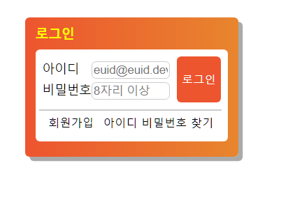

# CSS position 과제 구현

> **완성본**


<br/>  <p align='center'></p>


<br />

> **form 마크업**

<br />

`form action` => url을 줘 임의의url을 만들어 이 url로 데이터가 전송된다는것을 의미합니다
`method` => 어떤 방식(get,post)으로 데이터를 전송할 것인지 정의합니다.
`name` => 서버로 제출된 폼 데이터를 참조하기 위해 사용합니다.

<br />

`<fieldset>` => `legend` + `label` + `input` 으로 폼의 기본요소들을 구성했습니다 <br/>
`input` 태그의 속성으로는 `type`으로 email 인지 password인지 명시했고 `label`과 `input`의 연결을 위해 `id`선택자를 부여했습니다 `required` 속성으로 필수로 입력되어야할 값이란걸 정의했고, password에서 `minlength`속성을 사용해 최소 8자 이상으로 비밀번호를 입력해야한다는 것을 명시했습니다 <br />
`button` type의 기본값은 submit 이지만 submit이란 것을 알려주기 위해 명시적으로 사용했습니다


```html
  <form action="URL" method="POST" name="login">
            <fieldset>
              <legend class="a11yHidden">로그인 폼</legend> 
              <div class="userLoginInput">
                <label for="userId" class="userLoginInput__label">아이디</label
                ><input
                  type="email"
                  class="userLoginInput__input"
                  id="userId"
                  placeholder="euid@euid.dev"
                  required />
              </div>
              <div class="userPasswordInput">
                <label for="userPassword" class="userPasswordInput__label"
                  >비밀번호</label
                ><input
                  type="password"
                  class="userPasswordInput__input"
                  id="userPassword"
                  placeholder="8자리 이상"
                  minlength="8"
                  required />
              </div>
              <button class="userButton" type="submit">
                <span class="userButton__login">로그인</span>
              </button>
            </fieldset>
          </form>
```

<br />

> **하단부 마크업**

`ul` > `li` 구조로 마크업 했으며 userOnly라는 블록으로 정의해 나머지는 부품으로 생각해 `BEM`방법론으로 클래스를 부여했습니다 

```html
  <ul class="userOnly">
          <li>
            <span class="userOnly__user--join">회원가입</span>
          </li>
          <li>
            <span class="userOnly__user--missing">아이디 비밀번호 찾기</span>
          </li>
        </ul>
```

<br />

> **CSS 스타일링**

<br />

## 1. Container

가장 큰 div 요소인 `container` 클래스를 정의해 속성을 부여했고, margin : 50px은 화면에 너무 붙어있기에 임의의 값으로 줬습니다 <br />
`width`, `height`, `background`, `border-radius`, `box-shadow` 값은 figma 시안을 참고해서 작성하였습니다

```css
.container {
    position: relative;
    margin: 50px;
    width: 244px;
    height: 160px;
    background: linear-gradient(90deg, #ED552F 0%, #E8852E 100%);
    border-radius: 5px;
    box-shadow: 5px 5px 0px #AAAAAA;
}
```

<br />

## 2. 제목 및 로그인 폼 내부 영역
제목도 마찬가지로 figma 디자인 시안을 참고해서 container 기준으로 `padding`을 부여했습니다
 <br />
 <br />
**.formWrapper**는 container 내부의 **login-form**을 묶어주려는 의미로 래핑해 부모요소인 container에 `relative`를 주고, `position:absolute`를 준 후 top : 50%를 부여해 `container`기준 하단 좌측 아래에 붙게 만든 후 `right` 임의의 값 12px를 부여해 우측으로 옮기고, `maring-top : -43px`를 부여해 상단으로 올라오도록 구성했습니다 <br /><br />

**.formLoginWrapper**는 하단부 마크업과 상단부 마크업을 따로 묶어서 레이아웃해야하겠다고 생각되어 하단부를 제외한 `form` 서식 전부를 `div`태그로 묶었으며 `width`는 부모의 width(220px)를 100% 부여 했으며 `height` 및 `padding`은 피그마 시안과 동일하게 `padding`을 부여했습니다 <br/><br>

```css
/* 제목 */
.title {
    color: #ffff00;
    font-size: 15px;
    font-weight: 700;
    padding: 12px 8px 12px 12px;
}


/* 로그인 폼 내부 영역 */
.formWrapper {
    position: absolute;
    top: 50%;
    right: 12px;
    margin-top: -43px;
    width: 220px;
    height: 106px;
    background: #FFFFFF;
    border-radius: 5px;
}
.formLoginWrapper {
    width: 100%;
    height: 69px;
    padding: 14px 8px;
}
```

<br />

## 3. 로그인 폼 내부 id-input 및 password-input 영역 스타일링

부모요소를 `userLoginInput` 및 `userPasswordInput`으로 정의하여 `relative`를 부여하였으며 <br />
`label`의 `width`를 부여하여 본인의 `width`를 가지게 하였으며 <br />
해당 `input`들에 `absolute`를 부여하여 `right:0` 으로 인해 `label`과 `input`의 부모 요소인 `userLoginInput` 및 `userPasswordInput`의 오른쪽 외부 경계선 끝으로 가도록 배치하여 `label`과 `input`의 일정한 간격을 부여했습니다 <br />


```css
/* 로그인 폼 내부 영역 아이디 */
.userLoginInput{
    position: relative;
    width: 146px;
    height: 24px;
}
.userLoginInput__label {
    font-size: 14px;
    width: 56px;
}

.userLoginInput__input{
    position: absolute;
    right: 0;
    width: 90px;
    border-radius: 5px;
    border: 1px solid #CCCCCC

}


/* 로그인 폼 내부 영역 비밀번호 */

.userPasswordInput {
    position: relative;
    width: 146px;
    height: 24px;
}

.userPasswordInput__label {
    font-size: 14px;
    width: 56px;
}

.userPasswordInput__input{
    position: absolute;
    right: 0;
    width: 90px;
    border-radius: 5px;
    border: 1px solid #CCCCCC

}
```
<br />

## 4. 로그인 버튼 및 userOnly CSS 스타일링

**userButton**의 기준은 부모요소인 로그인 폼 바깥의 **container** 기준 삼아 스타일링 했습니다 <br />
`right : 0 및 top : 0`으로 컨테이너 오른쪽 상단 모서리에 위치하게 한후 <br />
`    margin: 8px;
    padding: 4px;` 임의의 값을 부여하여 여백을 줬습니다. <br />

하단의 상단 `border`는 끝에 끊겨있는것을 확인하여
가상요소 선택자인 `::before`를 이용해
해당 요소를 block 요소로 만들어 `width` 값 209px (피그마기준 선길이)를 부여하였으며 `userOnly`를 기준 삼아 `absoulute`로 `margin-top`의 임의의 값을 부여해 상단으로 `border`를 올렸습니다 <br />

**회원가입 과 아이디/비밀번호 찾기** 부분은 `float : left`로 좌측에 정렬시켜서 위치 시켰으며 `margin-left` 임의의 값 11px을 줘 해당 회원가입 과 아이디 비밀번호 찾기의 간격을 부여했습니다


```css
/*로그인 버튼*/
.userButton {
    position: absolute;   
    right: 0;
    top: 0;
    margin: 8px;
    padding: 4px;
    width: 50px;
    height: 53px;
    background: #ED552F;
    border-radius: 5px;
    border: none;
}
.userButton__login {
    top: 50%;
    font-size: 13px;
    color: #FFFFFF;
}
/*회원가입 및 아이디 비밀번호 찾기 영역*/
.userOnly {
    position: relative;
    margin: 8px 4px;
    height: 36px;
}

.userOnly::before {
    content: "";
    position: absolute;
    display: block;
    margin-top: -8px;
    width: 209px;
    border: 1px solid #CCCCCC;
}
.userOnly__user--join,.userOnly__user--missing {
    font-size: 13px; 
    float: left;
    margin-left: 11px;
}
```
