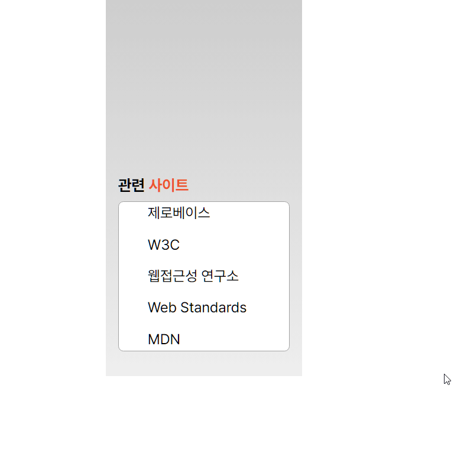

# HTML/CSS 3번째 과제 구현

<br />

## 완성본

<p style='center'><p>

<br />

> 요구사항
- 관련 사이트는 제목으로 각각 항목은 링크로 구현한다.
- 링크 목록은 5개이며 CSS를 사용하여 화면에 1개의 목록만 보이도록 구현한다.
- 목록에 마우스를 올리면 5개의 목록이 펼쳐지도록 구현한다.
- transition 속성을 활용하여 애니메이션 효과를 적용한다.
  

<br />
  <hr />
<br />


### 1. 마크업

<br />

```html
<section class="container">
      <div class="relatedSiteWrapper">
        <div class="titleWrapper">
          <h1 class="title">관련 <span class="highlight">사이트</span></h1>
        </div>
        <ul class="relatedSite">
          <li class="relatedSite__list">
            <a href="/" target="_blank"> 제로베이스 </a>
          </li>
          <li class="relatedSite__list">
            <a href="/" target="_blank"> W3C </a>
          </li>
          <li class="relatedSite__list">
            <a href="/" target="_blank"> 웹접근성 연구소 </a>
          </li>
          <li class="relatedSite__list">
            <a href="/" target="_blank"> Web Standards </a>
          </li>
          <li class="relatedSite__list">
            <a href="/" target="_blank"> MDN </a>
          </li>
        </ul>
      </div>
    </section>
```

<br />

- cotainer구조로 큰 틀을 잡고
- 하나의 다른 블록을 소유해야하기때문에
- relatedSiteWrapper로 묶었다
- 해당 conatiner안에 관련사이트라는 제목도 붙여야하기때문에
- titleWrapper 한번더 div로 래핑
- `ul > li > a` 로 `ul`태그 내에 마크업 진행함

<br />

### 2. CSS styling

<br />


- 전체 컨테이너에 가시성을 위해 임의로 margin 0 auto를 부여해 가운데 정렬을 했으며
- flex container로 만들어 하단 **relatedSiteWrapper**를 플렉스 아이템의 속성인 `align-self`을 사용하여 하단에 배치하도록 했다 <br />
- **컨텐츠 내부 영역**에 해당하는 `relatedSite 클래스`는 `display : flex` 적용후 `column`으로 세로축으로 정렬 후 `justify-content: space-between;` 으로 요소들을 시작부분과 끝에 밀착되게 정렬후 하위요소인 **listemfdprp** 상하로 `4px`씩 패딩을 부여함 <br />

```css
/* 전체 영역 */
.container {
    margin: 0 auto;
    display: flex;
    width: 11.875rem;
    height: 24rem;
    padding: 12px;
    background: linear-gradient(#CCCCCC,#EEEEEE);
}

/*컨텐츠 전체 영역*/
.relatedSiteWrapper {
    position: relative;
    align-self: flex-end;
    width: 100%;
    height: 50%;
}
```
<br />


### animation styling

<br />

```css
/*컨텐츠 내부 영역*/
.relatedSite {
    display: flex;
    flex-direction: column;
    justify-content: space-between;
    cursor: pointer;
    width: 100%;
    padding-left: 28px;
    height: 145px;
    background-color: #fff;
    border-radius: 5px;
    border: 1px solid #A3A3A3;
}
.relatedSite__list {
    font-size: 14px;
    padding: 4px 0;
}

.relatedSite:hover {
    height: 15%;
    transform: translateY(15%);
    overflow: hidden;
    transition: all 0.5s ease-in-out;
}
```

<br />

- 애니메이션은 부모요소인 `relatedSite클래스`에 `hover` 가상클래스 선택자를 사용하여 `hover` 됬을시 **높이**를 `145/15%`만큼 가지게 했고, <br />
- `transnform : translateY(15%)`는 해당 요소가 **현재 위치하고 있는 위치에서 15%만큼 아래쪽으로 이동**시키는 효과를 부여했음
- 박스크기가 작아지는 만큼 남겨지는 부분은 `overflow : hidden` 속성으로 감췄다
- `transition의 ease-in-out timing function`으로 **시작과 끝 모두에서 천천히 일어나지만 중간 어딘가에선 속도가 빨라지도록** 구현했음


